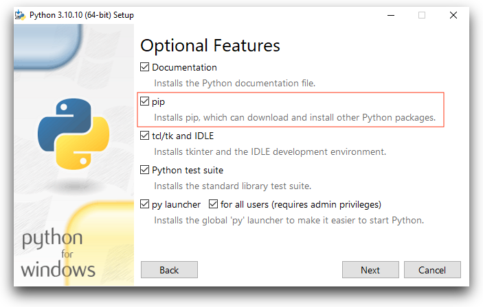

# THLHP Globus commandline guide

This guide describes the commandline method to to interactive with THLHP globus repositories to download binary files including PDFs, videos and MS access files. 

### List of contents
1. [Current collections](#collections)
2. [Installation](#2-installation)
3. [Authentication](#3-authentication)
4. [Example commands](#4-example-commands)
5. [External links](#5-external-links)

## 1. Current collections
There are currently 3 collections currently in use, in future this may get consolidated in to fewer collections. The UUIDs are required for accessing the collections through commandline.

1. **Tsimane Server**
    * UUID: 4a5589b3-8185-4aef-9a41-0436af652c80
    * Domain: g-218157.251141.e229.dn.glob.us
    * Description: This collection contains a mix of organized and unorganized files.

2. **Bolivia Upload**
    * UUID: 8532c070-75da-4ed4-9794-ca88dd69daec
    * Domain: g-7fdae8.251141.e229.dn.glob.us 
    * Description: This collection contains data that is directly uploaded from the field. The data is unorganized and may contain duplicates. 

2. **Margy Videos**
    * UUID: e59172e0-1a99-4932-a8c9-26e509485e03
    * Domain: g-0cc176.8e389.36fe.data.globus.org 
    * Description: This is a temporary collections  

## 2. Installation
The globus commandline application is installed through Pip which is a package manager for python.  

**Mac/Linux**

Globus can be installed globally by using the following command 

`pip install globus-cli`

**Windows**

1. Windows by default does not come with python or pip. You can install python by downloading the [official installer](https://www.python.org/downloads/) which comes bundled with pip. 
2. On the 'Optional Features' page of installation, make sure that the 'pip' option is checked (it is checked my default).

3. Install globus cli by opening command prompt and typing in 

    `pip install globus-cli`

## 3. Authentication
There are two methods for logging in to globus.
1. Local machine: You can log in to globus on your local machine by typing in `globus login` in command prompt/terminal. This will open a login prompt on your browser window.

2. Remote machine: This option is for situations when you the browser cannot be opened locally (servers, computational clusters). In this case you use the option `--no-local-server` and can log in using `globus login --no-local-server`.

## 4. Example commands

All globus commands follow the calling convention of `globus <command name> endpoint:/path/to/directory` similar to linux commands scp or rsync.

### 4.1 List contents of a directory.

`$ globus ls e59172e0-1a99-4932-a8c9-26e509485e03:/`

The above command prints all contents of root of the endpoint `e59172e0-1a99-4932-a8c9-26e509485e03`

### 4.2 Create a new directory

`$ globus mkdir e59172e0-1a99-4932-a8c9-26e509485e03:/new_directory` 

The above command creates a new directory `new_directory` in the root directory of the endpoint `e59172e0-1a99-4932-a8c9-26e509485e03`

### 4.3 Rename a directory

`$ globus rename e59172e0-1a99-4932-a8c9-26e509485e03 test_directory test`

The above command renames the directory `test_directory` in the root location of the endpoint `e59172e0-1a99-4932-a8c9-26e509485e03` to `test`

### 4.4 View all files recursively within an endpoint

`$ globus ls -lar e59172e0-1a99-4932-a8c9-26e509485e03:`

The above command will view all files and all directories within an endpoint. The `-l` arguments prints information in greater detail (similar to `ls -l`), `-a` is for all directories including hidden files and `-r` is for recursiveness.

*For endpoints with high number of directories this command will take a long time to run.*

### 4.5 Search/filter for particular file types.

`$ globus ls -alr e59172e0-1a99-4932-a8c9-26e509485e03:Videos\ de\ Jesus\ 2023 --filter '~*.mp4'`

The above command will print all files ending in `.mp4` within the directory `Videos de Jesus 2023`. For complete filtering options visit the detailed [globus ls filtering guide](https://docs.globus.org/cli/reference/ls/#filtering_2).

## 5. External links
1. [Complete command reference guide](https://docs.globus.org/cli/reference/)
2. [Globus cli source code]()
3. [Globus usage examples](https://docs.globus.org/cli/examples/)