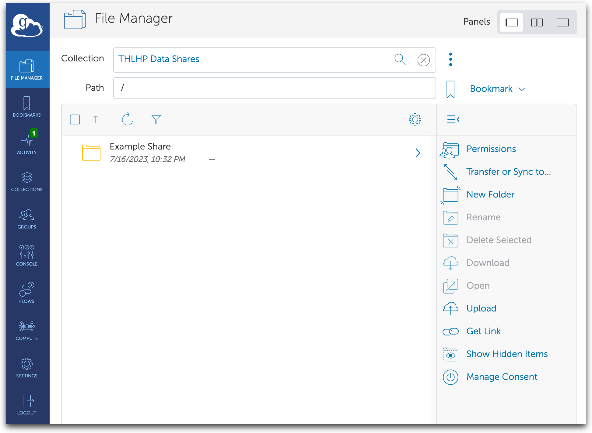
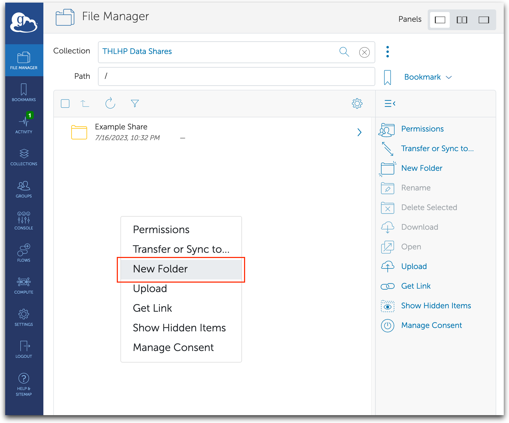
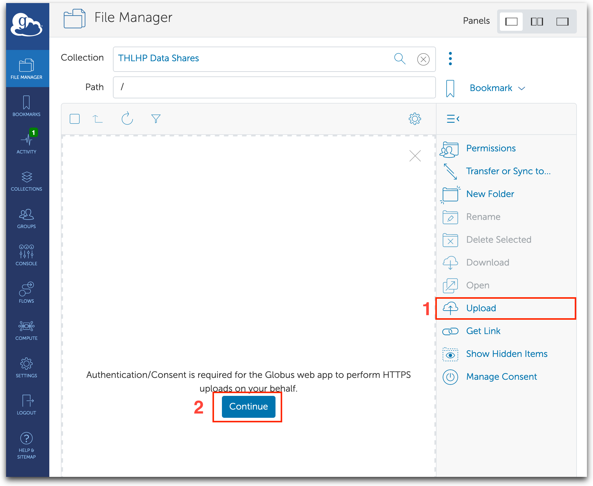
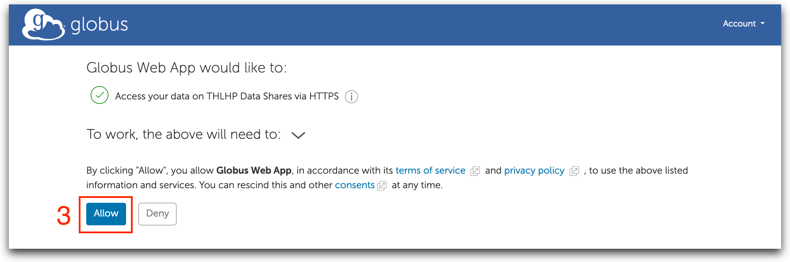
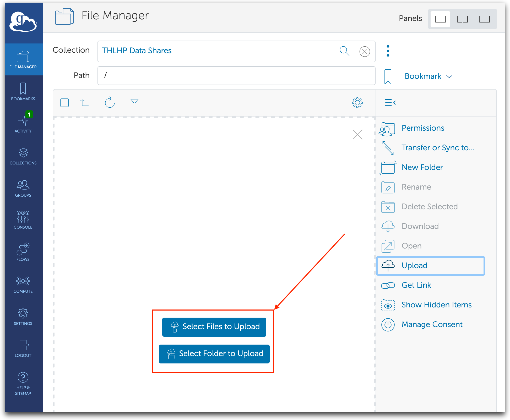
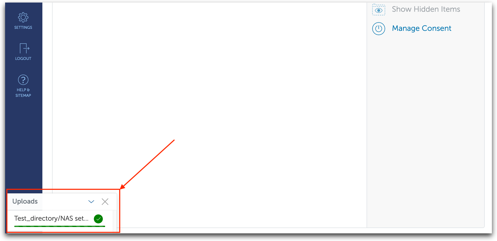
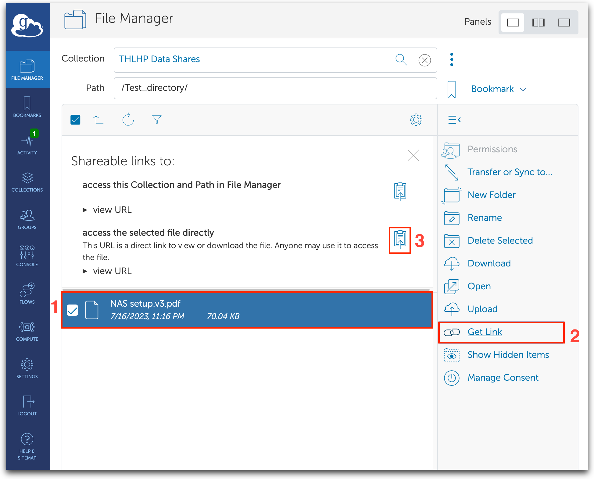
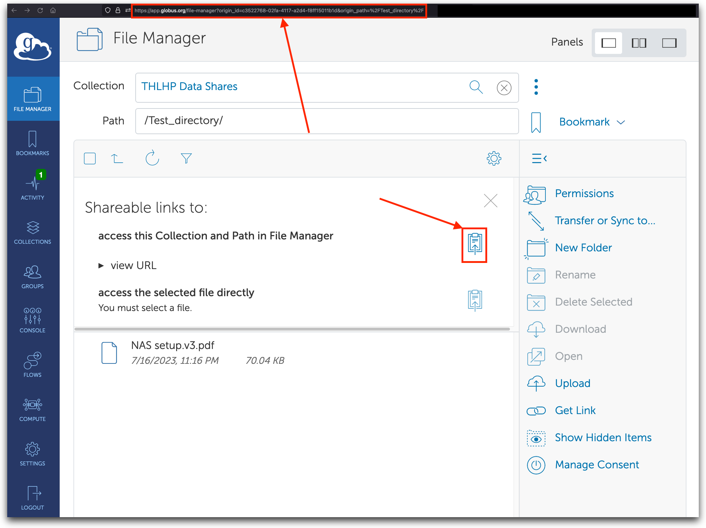
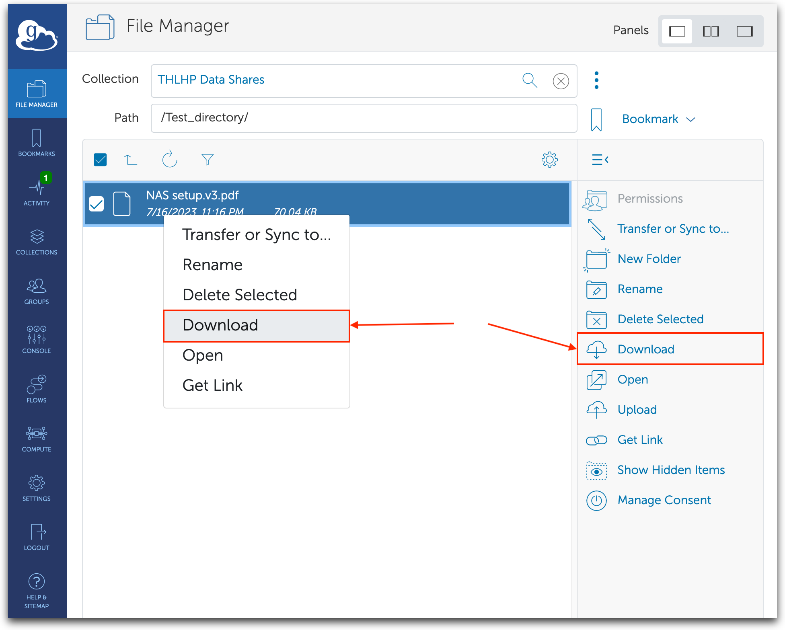
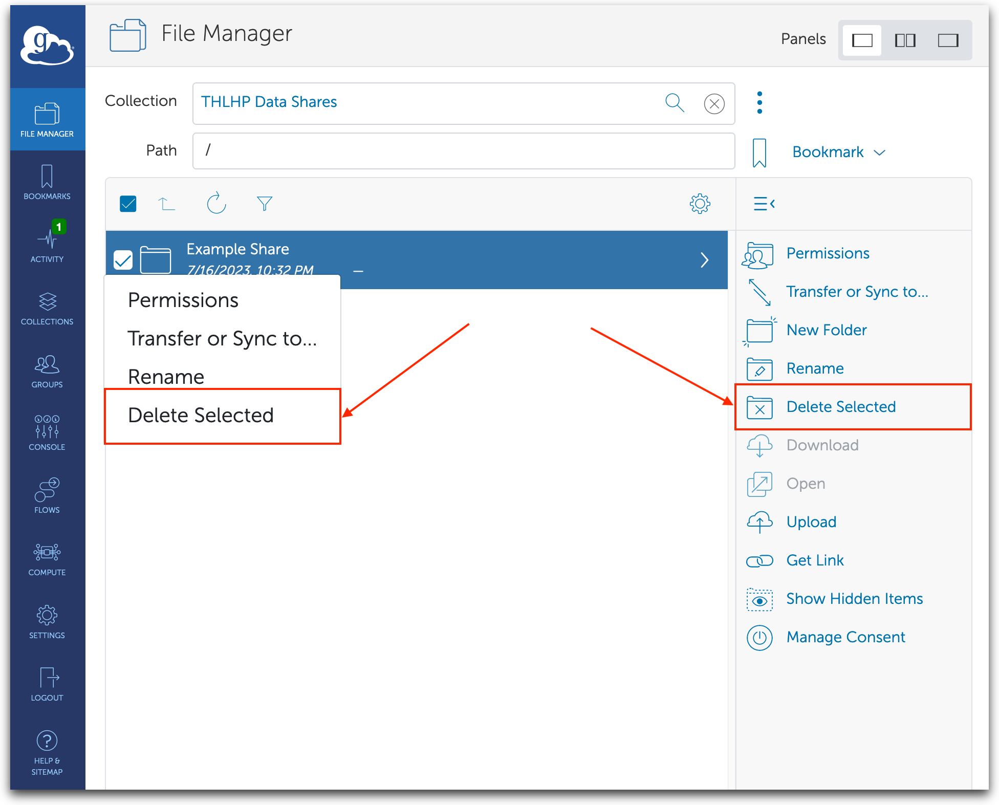

# THLHP Globus quick web app guide
This guide is for uploading files using the web interface of globus. This is useful for quickly uploading smaller files and generating a link that could be shared with collaborators. The data is uploaded to ASU on-site storage which is snapshotted every night with each snapshot kept for 30 days. 

### List of contents
1. [Globus endpoints](#1-globus-endpoints)
2. [Uploading files](#2-upload-using-web-app)
3. [Downloading files](#3-download-using-web-app)
4. [Deleting files](#4-deleting-files)
4. [Sharing uploads with specific users](#5-sharing-uploads-with-specific-users)

## 1. Globus endpoints
There is currently a single endpoint which by default makes any uploaded file accessible to all members of the THLHP project. The list of members that have access the THLHP Data Shares directory can be viewed using [this direct link](https://app.globus.org/groups/94d5f71b-21ae-11ee-b52a-955597948ffe/members)

* **[THLHP Data Shares](https://app.globus.org/file-manager?origin_id=c3522768-02fa-4117-a2d4-f8ff15011b1d)**
    * UUID: 3522768-02fa-4117-a2d4-f8ff15011b1d
    * Domain: g-ef43db.251141.e229.dn.glob.us
    * Description: Default collection which allows read and write access to all members of the project.

## 2. Upload using web app
1. Open the globus share using the web app. [Here is the direct link](https://app.globus.org/file-manager?origin_id=c3522768-02fa-4117-a2d4-f8ff15011b1d&origin_path=%2F)

2. When uploading single or multiple files first create a new folder by right clicking anywhere in the directory box and clicking 'New Folder'. Name the directory with a meaningful name as appropriate.

3.  a. Click the `Upload` button. If this is the first time you are uploading using the web interface then the application will request consent. 

On the next page click 'Allow'.

    b. Click one of the uploading options. 

4. After selecting the files for uploading the upload progress should be visible at the bottom left corner of the page. 

5. Once the upload concludes the directories should refresh and the uploaded directory should be visible in the list.

    a. Sharing link for downloading - File link
    
    Double click the newly uploading directory, single click the desired file and click `Get Link`. 

    

    b. Sharing link for downloading - Folder link

    For sharing link to entire folder one can either copy the current URL from the browser's address bar or click the copy link on `access this Collection and Path in File Manager`.

    

## 3. Download using web app
When downloading a single file using a direct link, opening the link should directly initiate the download (after authentication). When downloading specific files from a shared directory select individual files and click `Download` or right click the file and select download. *Note: Entire directories cannot be downloaded using the web app. The recommended method for downloading entire files is using the globus desktop client.*

## 4. Deleting files
Files or directories can be deleted by either selecting the path and clicking `Delete Selected` or by right clicking the path and choosing `Delete Selected`.

## 5. Sharing uploads with specific users
If sharing data with a particular subset of users instead of the whole THLHP group please use the `Private shares` directory under THLHP Data Shares. Please contact [Suhail Ghafoor](suhail.ghafoor@asu.edu) for setting up a protected directory. This directory can be used for sharing data within a specific group or between multiple groups. 